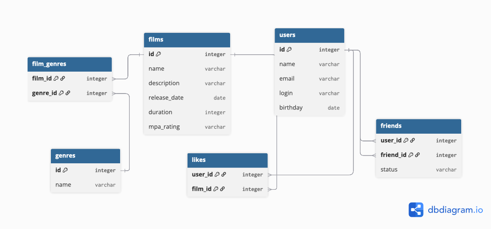

# java-filmorate
Template repository for Filmorate project.

Таблица users хранит данные пользователя
Таблица films хранит информацию о фильмах
Таблица film_genres реализует связь "многие ко многим"
Таблица likes хранит информацию о лайках пользователей
Таблица friends хранит информацию о дружбе между пользователями

Примеры запросов для основных операций:

1) Получить список всех пользователей 
    SELECT *
    FROM users;

2) Получить список всех фильмов
   SELECT *
   FROM films;

3) Вывести список общих друзей пользователей с id = 1 и id = 2
    SELECT u.*
    FROM users AS u
    JOIN friends AS f ON u.id = f.friend_id
    WHERE f.user_id IN (1, 2)
        AND f.status= 'CONFIRMED'
    GROUP BY u.id
    HAVING COUNT(DISTINCT f.user_id) = 2;

4) Вывести топ 10 популярных фильмов
    SELECT f.name,
            COUNT(l.user_id) AS likes_count
    FROM films AS f
    LEFT JOIN likes AS l ON f.id = l.film_id
    GROUP BY f.id, f.name
    ORDER BY likes_count DESC
    LIMIT 10;

5) Показать список жанров фильма с id = 1
    SELECT g.name
    FROM genres AS g
    JOIN film_genres AS f_g ON g.id = f_g.genre_id
    WHERE f_g.film_id = 1;
    